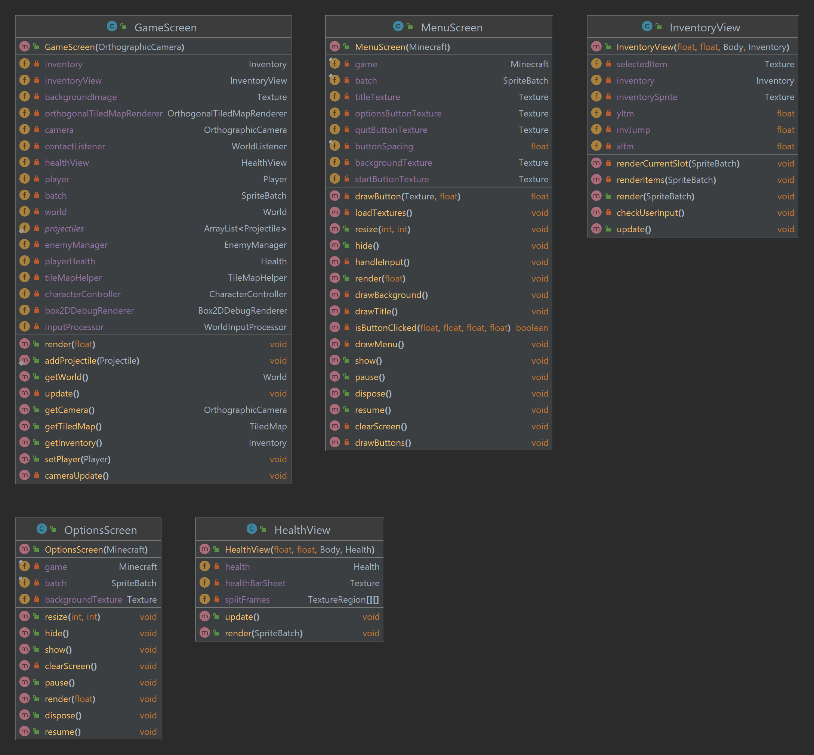

# Rapport – innlevering 3
**Team:** *Team 6* – *Magnus, Samuel, Nini, Martine*

## Prosjektrapport

Følgende skal med i team/prosjekt-rapporten, enten ved at det går frem fra referatene, og/eller at dere skriver en oppsummering. Sjekk at dere har vært innom alle punktene, selv om det bare er for å si at det fungerer bra.

### Roller
- [x] Hvordan fungerer rollene i teamet? Trenger dere å oppdatere hvem som er teamlead eller kundekontakt?
- [x] Trenger dere andre roller? Skriv ned noen linjer om hva de ulike rollene faktisk innebærer for dere.

Rollene i teamet fungerer nå bra! vi føler ikke på noe behov for å gjøre endringer i rollefordelingen. 

### Prosjektmetodikk & referat
- [x] Er det noen erfaringer enten team-messig eller mtp prosjektmetodikk som er verdt å nevne? Synes teamet at de valgene dere har tatt er gode? Hvis ikke, hva kan dere gjøre annerledes for å forbedre måten teamet fungerer på?
- [x] Referat fra møter siden forrige leveranse skal legges ved (mange av punktene over er typisk ting som havner i referat).

Vi synes at prosjektmetodikken vår fungerer bra så langt. Vi benytter oss av et project board gjennom Asana hvor vi lister opp oppgavene og om vi er underveis, ferdig med oppgaven etc. I tillegg har vi alltid en ukentlig gjennomgang under ukens gruppetime - da går vi gjennom hva som må prioriteres den neste uken. På denne måten fordeler vi oppgavene som må gjøres på en god måte.

Referatene fra alle møtene våre er å finne i referat-mappen vår som ligger her: `/doc/referat`. [Klikk her for å se siste referat.](referat/Referat-15.03.2024.txt)

### Gruppedynamikk
- [x] Hvordan er gruppedynamikken? Er det uenigheter som bør løses?
- [x] Hvordan fungerer kommunikasjonen for dere?

Gruppedynamikken vår er god og vi er alle samarbeidsorienterte. Vi ønsker alle å nå vårt felles mål: oppnå et minimum viable product og et bra semesterprosjekt. Vi har god kommunikasjon innad i gruppen gjennom Discord - som er nok noe av grunnen til at vi ikke har noen uenigheter som må løses. På Discord har vi muligheten til å holde kontakten gjennom uken, dele informasjon og diskutere ideer på en effektiv måte. Vi er flinke til å lytte til hverandre, og eventuelle spørsmål gruppemedlemmer har blir raskt besvart. Alt i alt, kommunikasjonen i gruppen vår er en styrke.

### Retrospektiv 
- [ ] Gjør et kort retrospektiv hvor dere vurderer hva dere har klart til nå, og hva som kan forbedres. Dette skal handle om prosjektstruktur, ikke kode. Dere kan selvsagt diskutere kode, men dette handler ikke om feilretting, men om hvordan man jobber og kommuniserer.

Nå har vi endelig oppnådd alle kravene vi hadde satt for MVP. 

- [ ] Bli enige om maks tre forbedringspunkter fra retrospektivet, som skal følges opp under neste sprint.

Vi har funnet ut at det er noen punkt vi skal ha ekstra fokus på frem mot siste innlevering, de er listet opp her: 

1. punkt1
2. punkt2
3. punkt3

### Fordeling av bidrag til kodebasen
- [x] Under vurdering vil det vektlegges at alle bidrar til kodebasen. Hvis det er stor forskjell i hvem som committer, må dere legge ved en kort forklaring for hvorfor det er sånn. Husk å committe alt. (Også designfiler)

Vi bidrar alle likt til kodebasen, selv om antall commits ikke alltid er helt fordelt blant gruppemedlemmene, så kommer dette av at noen commits har et større omfang, men totalt sett er bidrag til kodebasen jevnt fordelt.  

## Krav og spesifikasjon

- [ ] Kravlista er lang, men det er ikke nødvendig å levere på alle kravene hvis det ikke er realistisk. Det er viktigere at de oppgavene som er utført holder høy kvalitet. Utførte oppgaver skal være ferdige.

### MVP-Krav
- [ ] Oppdater hvilke krav dere har prioritert, hvor langt dere har kommet og hva dere har gjort siden forrige gang. Er dere kommet forbi MVP? Forklar hvordan dere prioriterer ny funksjonalitet.
- [ ] Har dere gjort justeringer på kravene som er med i MVP? Forklar i så fall hvorfor. Hvis det er gjort endringer i rekkefølge utfra hva som er gitt fra kunde, hvorfor er dette gjort?

##### Krav til Minimum Viable Product:
- [x] 1. Vise et spillebrett
- [x] 2. Vise spiller på spillebrett
- [x] 3. Flytte spiller med pil-taster, spesifisert mer i readme
- [x] 4. Spiller interagerer med terreng (vha. mus for å klikke på blokker)
- [x] 5. Vise fiender/monstre; de skal interagere med terreng og spiller
- [x] 6. Spiller kan dø (ved kontakt med fiender ==og ved å falle utfor skjermen==)
- [ ] 7. Mål for spill: overleve x-antall netter.
- [x] 8. Nytt spillbrett når forrige er ferdig
- [x] 9. Start-skjerm ved oppstart / game over, samt en skjerm som viser ulike tastetrykk etc man kan bruke i spillet

Vi har gjennomgått MVP-kravene på nytt og vurdert om noen justeringer er nødvendig. I oblig 2 gjorde vi noen endringer i punkt 7 og 8 - men vi har nå besluttet å gjøre endringer for disse punktene igjen. Punkt 8 er nå det samme som det opprinnelig var. Samt at vi har spesifisert i punkt 7 at målet er å overleve x-antall netter. Vi har besluttet å fjerne kravet om å implementere en boss, da vi fant ut at det ville kreve for mye tid og ressurser å legge til denne funksjonaliteten på dette stadiet. Våre MVP-krav er de i listen ovenfor - nedenfor er hva vi hadde fra oblig 2.

    7. Mål for spillbrett: Vi tenker å ha en portal som man må åpne med en nøkkel. Når man entrer portalen så får man en BOSS man må bekjempe. Når BOSS dør vinner man spillet!
    8. Nytt spillbrett når forrige er ferdig. Når man bekjemper bossen eller dør så får man en skjerm hvor man kan velge å starte spillet på nytt.

Årsaken til endringen var at vi fant ut at det ble for omfattende å implementere en ny funksjonalitet med en boss når vi hadde "viktigere ting å gjøre"; som å implementere objektfabrikker og lyd som er noen av kravene til semesteroppgaven.

Vi fant ut at koden vår ikke hadde god nok MVC-struktur, manglende interfaces samt at vi hadde lav testdekning. Istedenfor å implementere noe nytt som ville gitt oss mer jobb - fant vi ut at det er nok best om vi forbedrer den allerede eksisterende koden. Dessuten vil bedre MVC-struktur gjøre det enklere å legge til nye funksjoner, som for eksempel en boss, senere, dersom vi får tid til det. For oss, som programutviklere, var det viktigere å prioritere kodekvalitet og vedlikeholdbarhet istedenfor flere funksjoner i spillet. 

Istedenfor å strekke oss forbi MVP har vi fokusert på å oppnå et solid MVP-nivå før vi vurderer å legge til ytterligere funksjonalitet. Tidligere har vi prioritert å legge til ny funksjonalitet - men ikke tenkt på testing og bruk av interfaces samtidig.

Å øke testdekning, restrukturere koden til MVC-struktur og mer bruk av interfaces har involvert en betydelig mengde arbeid - og vi har enda en lang vei å gå. Nå i ettertid er vi glade for at vi gjorde endring i MVP-kravene - slik at vi fikk mulighet til å fokusere på å forbedre kodekvalitet og testdekning.

### Brukerhistorier, akseptansekriterier & prioritering av arbeidsoppgaver
- [ ] For hvert krav dere jobber med, må dere lage: 
    1) ordentlige brukerhistorier
    2) akseptansekriterier (husk at akseptansekriterier ofte skrives mer eller mindre som tester)
    3) arbeidsoppgaver
- [ ] Dersom dere har oppgaver som dere skal til å starte med, hvor dere har oversikt over både brukerhistorie, akseptansekriterier og arbeidsoppgaver, kan dere ta med disse i innleveringen også.
- [ ] Forklar kort hvordan dere har prioritert oppgavene fremover
- [ ] Oppdater hvilke krav dere har prioritert, hvor langt dere har kommet og hva dere har gjort siden forrige gang.

#### Brukerhistorier fra oblig 1

###### Historie 1:
Som spiller trenger jeg å kunne samle ressurser som tre, stein, og mineraler, slik at jeg kan bygge og oppgradere verktøy, våpen og strukturer i spillet som jeg kan bruke i spillet for å bekjempe fiender og bygge ting.

Akseptansekriterier
   - [x] Spilleren kan samle tre, stein og mineraler ved å klikke på dem i spillet.
   - [x] Ressursene vises i spillerens inventar etter å ha blitt samlet inn.
   - [ ] Spilleren kan bruke de innsamlede ressursene til å bygge og oppgradere verktøy, våpen og strukturer.

Arbeidsoppgaver
   - [x] Implementere klikkfunksjonalitet for å samle ressurser.
   - [x] Utvikle inventarsystem for å lagre og administrere ressurser.
   - [x] Opprette funksjonalitet for bygging og oppgradering av gjenstander basert på ressursene.

###### Historie 2:
Som spiller trenger jeg å kunne skille stein-blokker, jord-blokker etc. fra bakgrunnselementer slik at jeg avgjøre hvordan jeg skal styre spillfiguren og hvilke blokker jeg ønsker å knuse/samle inn.

Akseptansekriterier:
   - [x] Spilleren kan skille mellom ulike typer blokker som stein, jord osv. visuelt.
   - [ ] Muligheten til å ha en form form mus over blokker slik at spiller kan se hva hen knuser/samler inn av blokker.

Arbeidsoppgaver:
   - [x] Implementere forskjellige blokktyper som ser ulike ut visuelt.
   - [x] Utvikle mekanisme for å knuse og samle inn blokker.
   - [ ] Opprette grensesnitt der spilleren kan velge ønsket blokk å knuse, feks. en musehånd som er synlig på skjermen.

###### Historie 3:
Som programmør trenger jeg å kunne skille bakgrunnselementer og spill-blokker fra hverandre, slik at jeg kan avgjøre hvor spillfiguren kan bevege seg.

Arbeidsoppgaver:
   - [x] Identifisere og definere bakgrunnselementer og spillblokker, samt forskjellen mellom dem.
   - [x] Implementere kollisjonsdeteksjon mellom spillfiguren og bakgrunnselementene.
   - [x] Utvikle bevegelsesmekanismer for spilleren basert på skillet mellom spillfigur og bakgrunnen.

###### Historie 4:
Som spiller trenger jeg å kunne utforske forskjellige steder, som skoger, ørkener og fjellområder, slik at jeg kan finne sjeldne ressurser og oppleve et variert spill.

Akseptansekriterier:
   - [x] Minecraft 2D må ha varierte spill-miljøer slik at man kan bevege seg gjennom skog, ørken og fjell bla. 
   - [x] Sjeldne ressurser må være tilgjengelig i spillet

Arbeidsoppgaver:
   - [x] Designe ulike spill-miljøer som har sjeldne ressurser
   - [ ] Lage et system som generer terreng og plasserer sjeldne ressurser tilfeldig, samtidig som plassering av objekter gir mening feks. ikke et tre i ørkenen. 

###### Historie 5:
Som spiller trenger jeg å kunne bekjempe fiender og monstre som angriper om natten og mørke steder som f.eks. huler, slik at jeg kan beskytte meg selv og mine byggverk.

Akseptansekriterier:
   - [ ] Fiender angriper om natten og i mørke områder.
   - [x] Spilleren må kunne bekjempe fiender ved bruk av våpen.

Arbeidsoppgaver:
- [x] Designe og animere fiendetyper.
- [x] Implementere AI for fiender og hvordan de angriper spilleren/oppfører seg.
- [x] Utvikle mekanikk for spilleren og hvordan den bruker våpen for å bekjempe zombier etc.

#### Brukerhistorier basert på MVP-krav

##### 1: Vise et spillebrett

###### Brukerhistorie:
Som spiller ønsker jeg å se et spillebrett på skjermen slik at jeg kan navigere rundt i spillets verden for å utforske. Som spiller må det være lett for meg å identifisere hva som er en del av verdenen soom blokker og hva som er f.eks. himmel/bakgrunn.

###### Akseptansekriterier:
- [x] Når selve spillet startes, vises et tomt spillebrett.
- [x] Spillebrettet med blokker for gress, jord etc. er visuelt forskjellige.
- [x] Blokkene skiller seg ut fra bakrgunnen.
- [x] Blokkene har kollisjonsdeteksjon, slik at spilleren ikke kan gå gjennom blokkene.
- [x] Spillbrettet må vises korrekt i vinduet, slik at man ikke er "midt i bakken", men på toppen av blokker. 

###### Arbeidsoppgaver:
- [x] Opprett grunnleggende elementer for å vise en tom skjerm
- [x] Opprett et kart med blokker som skal vises på skjermen.
- [x] Spillbrettet må ha med blokker med kollisjonsdeteksjon.
- [x] Sentraliser spillverdenen på skjermen, slik at man ikke er "midt i bakken".

##### 2: Vise spiller på spillebrett

###### Brukerhistorie:
Som spiller ønsker jeg å kunne se karakteren min på spillebrettet, slik at jeg kan identifisere meg selv i spillets verden.

###### Akseptansekriterier:
- [x] Når spillet starter, vises spilleren på spillebrettet.
- [x] Spilleren vises på spillebrettet som en distinkt figur som er lett synlig for meg som spiller. 
- [x] Det må være lett for spilleren å se spillkarakteren - ved at den f.eks. er sentraliser og skiller seg ut fra bakgrunnen.
- [x] Spilleren må stå på blokker, og ikke gå gjennom dem. 

###### Arbeidsoppgaver:
- [x] Finn animasjon til spillkarakter
- [x] Implementer logikk for å vise spillerkarakteren på spillebrettet.
- [x] Implementer logikk slik at spillerkarakteren kan vise ulike animasjoner som; gå, stå, angripe etc.
- [x] Spilleren må sentraliseres i forhold til spillvinduet. 
- [x] Implementer kollisjonsdeteksjon mellom spiller og enkelte blokker, som stein, jord, gress etc.

##### 3: Flytte spiller med pil-taster

###### Brukerhistorie:
Som spiller ønsker jeg å kunne bruke piltastene til å flytte karakteren min på spillebrettet, slik at jeg kan utforske omgivelsene og unngå farer som fiender.

###### Akseptansekriterier:
- [x] Ved å trykke på de angitte piltastene, beveger spilleren seg på spillebrettet i den angitte retningen.
- [x] Spiller kan angripe ved å trykke på en tast.
- [x] Spiller kan hoppe, men ikke uendelig mange hopp på en gang. 
- [x] Spiller har forskjellige animasjoner ut i fra om den går, slår og hopper. 
- [x] Spiller kan ikke bevege seg gjennom blokker

###### Arbeidsoppgaver:
- [x] Legg til styring med taster for å flytte spilleren på spillebrettet.
- [x] Legge til funksjonalitet slik at spiller kan hoppe, men begrense dette til dobbelthopp. 
- [x] Spiller må ha kollisjonsdeteksjon med andre blokker. 

##### 4: Spiller interagerer med terreng

###### Brukerhistorie:
Som spiller ønsker jeg å kunne bruke musen, ved å klikke på blokker for å samle ressurser eller bygge strukturer.

###### Akseptansekriterier:
- [x] Spilleren kan klikke på blokker på spillebrettet med musen - og det skjer da en interaksjon slik at blokken blir lagt til i inventory.
- [ ] Ved klikking på blokker spilles det av en lyd.
- [x] Spillbrettet blir endret når man fjerner/plasserer blokker i spillverdenen.

###### Arbeidsoppgaver:
- [x] Implementere en muselytter i kontroller slik at man har mulighet til å få inn input fra spiller.
- [x] Implementer interaksjon med miljøet ved å klikke på blokker med musen.
- [x] Sørge for at blokker som blir ødelagt blir lagt til spillerens inventory og at blokker som blir plassert fjernes fra inventory. 
- [ ] Ved klikking på blokker så blir blokken fjernet fra spillbrettet + legg til lyd når man klikker på blokker

##### 5: Vise fiender/monstre

###### Brukerhistorie:
Som spiller ønsker jeg å kunne se fiender på spillebrettet, slik at jeg kan være oppmerksom på trusler i spillets verden.

###### Akseptansekriterier:
- [x] Fiender vises på spillebrettet
- [x] Fiender beveger seg i henhold til spillets regler.
- [x] Fiender kan iteragere med spiller og terrengblokker.
- [x] Fiender må kunne bekjempe spiller.

###### Arbeidsoppgaver:
- [x] Legge til animasjon for ulike fiender.
- [x] Utvikle logikk for å generere og styre fiender på spillebrettet.
- [x] Implementere at fiender genereres automatisk. 
- [x] Fiender må bevege seg automatisk og ha mulighet til å gjøre skade på spiller.

##### 6: Spiller kan dø

###### Brukerhistorie:
Som spiller ønsker jeg å oppleve konsekvenser av å miste alle helsepoengene mine, enten ved å kollidere med fiender eller ved å falle utfor skjermen, slik at spillet blir mer utfordrende og realistisk.

###### Akseptansekriterier:
- [x] Når spilleren kolliderer med en fiende, mister spilleren liv og kan til slutt dø når alle liv er brukt.
- [ ] Når spilleren faller utenfor skjermen mister den et liv og kan dø.

###### Arbeidsoppgaver:
- [x] Implementer kollisjonssjekker mellom spilleren og fiender.
- [x] Implementer helse/liv for spilleren 
- [x] La spilleren sin animasjon endres ved spillerdød.
- [x] Implementer en kontroll for spillerens posisjon på skjermen for å sjekke om spilleren har falt utfor spillbrettet.

##### 7: Mål for spill

###### Brukerhistorie:
Som spiller ønsker jeg å ha et mål i spillet, for eksempel å overleve et visst antall netter, slik at jeg har noe å jobbe mot og oppleve progresjon i spillet.

###### Akseptansekriterier:
- [ ] Spilleren har et visst antall liv, og spillet har et definert mål for å overleve et visst antall netter.
- [ ] Spilleren mottar tilbakemelding når målet er oppnådd.

###### Arbeidsoppgaver:
- [ ] Implementer telling av netter i spillet.
- [ ] Definer et klart mål for antall netter spilleren må overleve.
- [ ] Gi tilbakemelding til spilleren når målet er oppnådd.

##### 8: Nytt spillbrett når forrige er ferdig

###### Brukerhistorie:
Som spiller ønsker jeg å kunne fortsette å spille selv om jeg har tapt, ved å få et nytt spillebrett når jeg har fullført det forrige.

###### Akseptansekriterier:
- [x] Etter at spilleren har oppfylt målet eller dødd, vises en ny startskjerm eller game over-skjerm.

###### Arbeidsoppgaver:
- [x] Lag startskjerm og game over-skjerm med tilhørende funksjonalitet.
- [x] Implementere tilbakestilling av spilltilstand og generering av nytt spillebrett ved start av nytt spill.

##### 9: Start-skjerm ved oppstart / game over

###### Brukerhistorie:
Som spiller ønsker jeg å kunne starte et nytt spill fra en startskjerm, samt se en game over-skjerm hvis jeg mislykkes, slik at jeg kan ha kontroll over spillopplevelsen min.

###### Akseptansekriterier:
- [x] Ved oppstart av spillet vises en startskjerm som gir spilleren valgmuligheter.
- [x] Når spilleren starter et nytt spill fra startskjermen, genereres et nytt spillebrett.
- [x] Når spilleren dør, vises en game over-skjerm som informerer spilleren om utfallet og tilbyr valg som å starte nytt spill eller å fortsette i samme verden, men med nye liv.
- [x] Spiller må ha mulighet til å se oversikt over kontrollmuligheter i spillet.

###### Arbeidsoppgaver:
- [x] Implementer startskjerm med nødvendig informasjon og valgmuligheter.
- [x] La startskjermen ha en mulighet til å vise oversikt over hvilke tastetrykk og musebevegelser spiller kan bruke i spillet.
- [x] Implementer generering av nytt spillebrett når spillet startes på nytt fra startskjermen.
- [x] Implementer game over-skjerm med informasjon om utfallet og valgmuligheter.

#### Bugs
- [ ] Husk å skrive hvilke bugs som finnes i de kravene dere har utført (dersom det finnes bugs).

Vi har noen bugs i koden vår som vi ønsker å utbedre frem mot siste innlevering. Vi tenker at ved flere tester så kan vi lettere finne ut hva som er galt for å så rette opp i det. 

- Blant annet så sitter spilleren "fast" noen ganger når man går mot høyre/venstre
- andre bugs

### Produkt og kode
(Evt. tekst / kommentarer til koden kan dere putte i en egen ## Kode-seksjon)

#### Hvordan bygge, teste og kjøre prosjektet
- [x] I README.md: Dere må dokumentere hvordan prosjektet bygger, testes og kjøres, slik at det er lett for gruppelederne å bygge, teste og kjøre koden deres. Under vurdering kommer koden også til å brukertestes. 
- [x] Prosjektet skal kunne bygge, testes og kjøres på Linux, Windows og OS X – dere kan f.eks. spørre de andre teamene på gruppen om dere ikke har tilgang til alle platformene. OBS! Den vanligste grunnen til inkompatibilitet med Linux er at filnavn er case sensitive, mens store/små bokstaver ikke spiller noen rolle på Windows og OS X. Det er viktig å sjekke at stiene til grafikk og lyd og slikt matcher eksakt. Det samme vil antakelig også gjelde når man kjører fra JAR-fil.
- [x] Utførte oppgaver skal være ferdige. Slett filer/kode som ikke virker eller ikke er relevant (ennå) for prosjektet. (Så lenge dere har en egen git branch for innlevering, så er det ikke noe stress å fjerne ting fra / rydde den, selv om dere fortsetter utviklingen på en annen gren.)

For instrukser ift. bygging, testing og kjøring av kode [se README.md.](../README.md)
Vi har testet at prosjektet fungerer på Windows og OS X - men vi har ikke sjekket om det fungerer på Linux enda. Det er noe vi selvsagt skal gjøre før siste innlevering. 

#### Utbedring av feil & testing
- [ ] Utbedring av feil: hvis dere har rettet / forbedret noe som er påpekt tidligere, lag en liste med «Dette har vi fikset siden sist», så det er lett for gruppelederne å få oversikt.
- [ ] Statiske analyseverktøy som SpotBugs eller SonarQube kan hjelpe med å finne feil dere ikke tenker på. Hvis dere prøver det, skriv en kort oppsummering av hva dere fant / om det var nyttig.
- [ ] Automatiske tester skal dekke forretningslogikken i systemet (unit-tester). Coverage kan hjepe med å se hvor mye av koden som dekkes av testene – i Eclipse kan dette gjøres ved å installere EclEmma gjennom Eclipse Marketplace.
- [ ] Kodekvalitet og testdekning vektlegges. Dersom dere ikke har automatiske tester for GUI-et, lager dere manuelle tester som gruppelederne kan kjøre basert på akseptansekriteriene.

##### Dette har vi fikset siden sist:
- punkt
- punkt

#### Klassediagram
- [ ] Lag og lever et klassediagram. (Hvis det er veldig mange klasser, lager dere for de viktigste.) Det er ikke nødvendig å ta med alle metoder og feltvariabler med mindre dere anser dem som viktige for helheten. (Eclipse har forskjellige verktøy for dette.)

Se nedenfor for klassediagram av koden vår:

Klassediagramsoversikt:

Klassediagram for kontroller:

Klassediagram for modell:

Klassediagram for view:

Klassediagram for utils:

