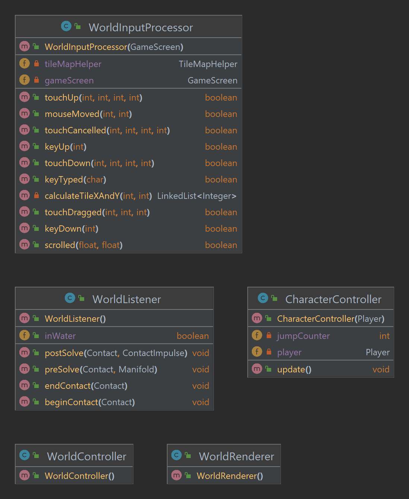
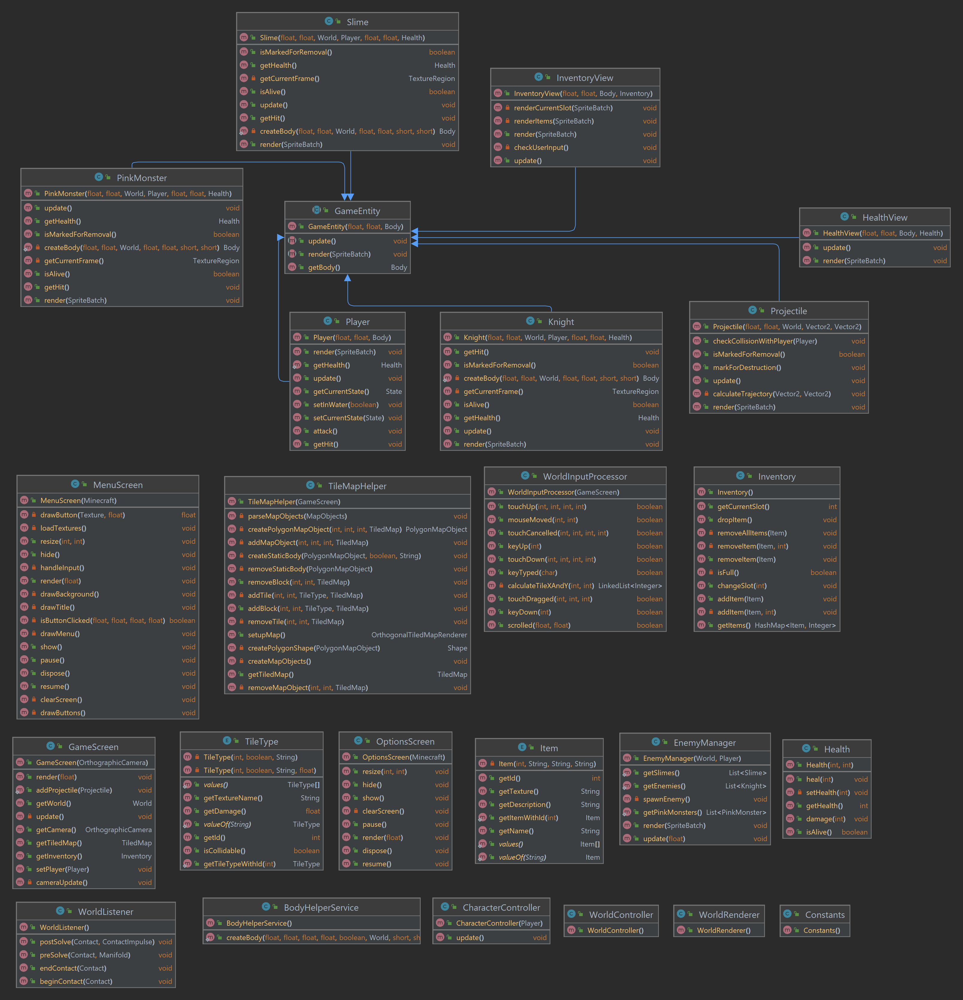
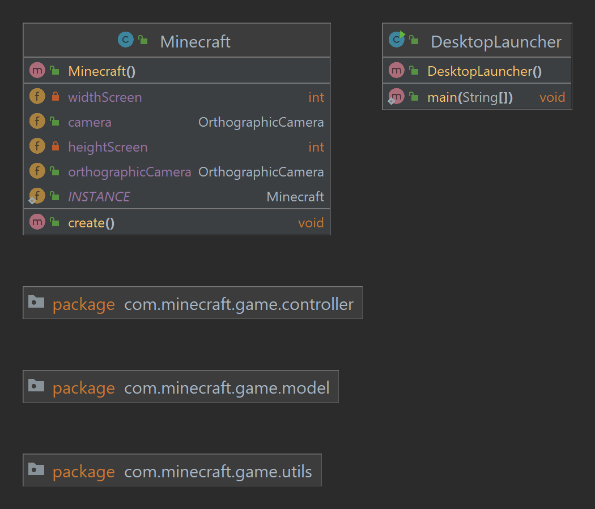
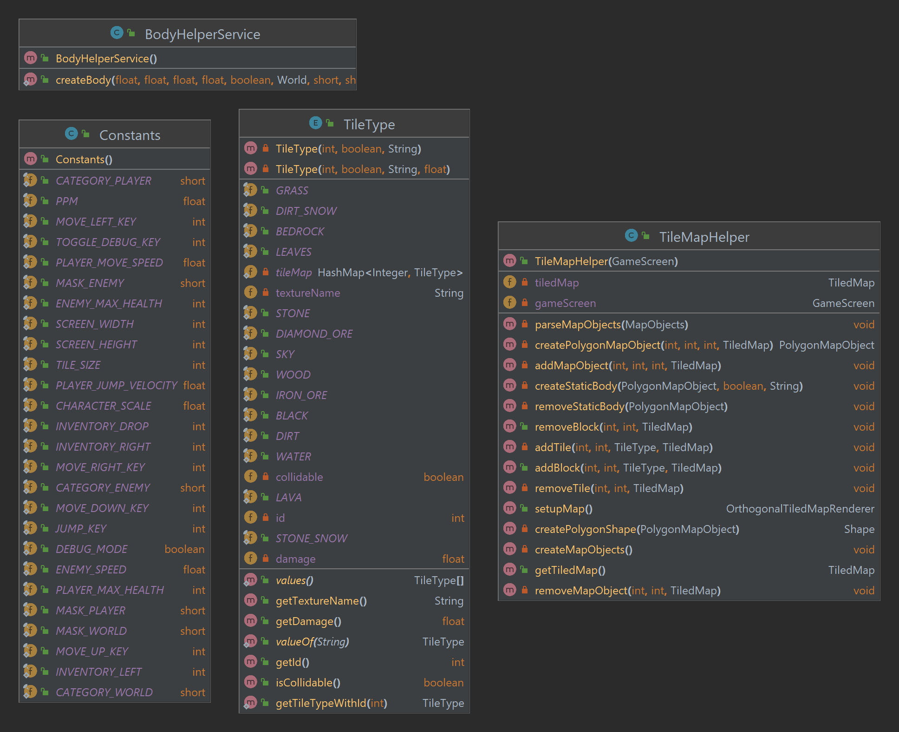
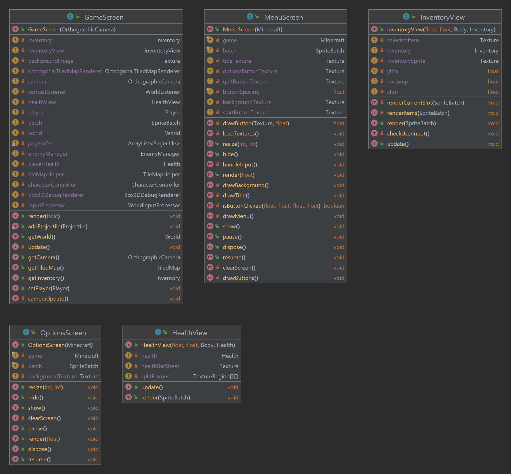

# Rapport – innlevering 4
**Team:** *Team 6* – *Magnus, Samuel, Nini, Martine*

#### Prosjektrapport
(Leveres i doc/obligX.md.)

Følgende skal med i team/prosjekt-rapporten, enten ved at det går frem fra referatene, og/eller at dere skriver en oppsummering. Sjekk at dere har vært innom alle punktene, selv om det bare er for å si at det fungerer bra.

##### Roller
- [ ] Hvordan fungerer rollene i teamet? Trenger dere å oppdatere hvem som er teamlead eller kundekontakt?
- [ ] Trenger dere andre roller? Skriv ned noen linjer om hva de ulike rollene faktisk innebærer for dere.

Rollene i teamet fungerer nå bra! vi føler ikke på noe behov for å gjøre endringer i rollefordelingen. 

##### Prosjektmetodikk & referat
- [ ] Er det noen erfaringer enten team-messig eller mtp prosjektmetodikk som er verdt å nevne? Synes teamet at de valgene dere har tatt er gode? Hvis ikke, hva kan dere gjøre annerledes for å forbedre måten teamet fungerer på?
- [ ] Referat fra møter siden forrige leveranse skal legges ved (mange av punktene over er typisk ting som havner i referat).

Vi synes at prosjektmetodikken vår fungerer bra så langt. Vi benytter oss av et project board gjennom Asana hvor vi lister opp oppgavene og om vi er underveis, ferdig med oppgaven etc. I tillegg har vi alltid en ukentlig gjennomgang under ukens gruppetime - da går vi gjennom hva som må prioriteres den neste uken.

Referatene fra alle møtene våre er å finne i referat-mappen vår. [Klikk her for å på siste referat.](referat/Referat-15.03.2024.txt)

##### Gruppedynamikk
- [ ] Hvordan er gruppedynamikken? Er det uenigheter som bør løses?
- [ ] Hvordan fungerer kommunikasjonen for dere?

##### Retrospektiv 
- [ ] Gjør et kort retrospektiv hvor dere vurderer hva dere har klart til nå, og hva som kan forbedres. Dette skal handle om prosjektstruktur, ikke kode. Dere kan selvsagt diskutere kode, men dette handler ikke om feilretting, men om hvordan man jobber og kommuniserer.
- [ ] Bli enige om maks tre forbedringspunkter fra retrospektivet, som skal følges opp under neste sprint.
- [ ] For siste innlevering (Oblig 4): Gjør et retrospektiv hvor dere vurderer hvordan hele prosjektet har gått. Hva har dere gjort bra, hva hadde dere gjort annerledes hvis dere begynte på nytt?

##### Fordeling av bidrag til kodebasen
- [ ] Under vurdering vil det vektlegges at alle bidrar til kodebasen. Hvis det er stor forskjell i hvem som committer, må dere legge ved en kort forklaring for hvorfor det er sånn. Husk å committe alt. (Også designfiler)

#### Krav og spesifikasjon
(Leveres i doc/obligX.md.)

- [ ] Kravlista er lang, men det er ikke nødvendig å levere på alle kravene hvis det ikke er realistisk. Det er viktigere at de oppgavene som er utført holder høy kvalitet. Utførte oppgaver skal være ferdige.

##### MVP-Krav
- [ ] Oppdater hvilke krav dere har prioritert, hvor langt dere har kommet og hva dere har gjort siden forrige gang. Er dere kommet forbi MVP? Forklar hvordan dere prioriterer ny funksjonalitet.
- [ ] Har dere gjort justeringer på kravene som er med i MVP? Forklar i så fall hvorfor. Hvis det er gjort endringer i rekkefølge utfra hva som er gitt fra kunde, hvorfor er dette gjort?

###### Brukerhistorier, akseptansekriterier & prioritering av arbeidsoppgaver
- [ ] For hvert krav dere jobber med, må dere lage: 
1) ordentlige brukerhistorier
2) akseptansekriterier (husk at akseptansekriterier ofte skrives mer eller mindre som tester)
3) arbeidsoppgaver
- [ ] Dersom dere har oppgaver som dere skal til å starte med, hvor dere har oversikt over både brukerhistorie, akseptansekriterier og arbeidsoppgaver, kan dere ta med disse i innleveringen også.
- [ ] Forklar kort hvordan dere har prioritert oppgavene fremover
- [ ] Oppdater hvilke krav dere har prioritert, hvor langt dere har kommet og hva dere har gjort siden forrige gang.

###### Bugs
- [ ] Husk å skrive hvilke bugs som finnes i de kravene dere har utført (dersom det finnes bugs).

#### Produkt og kode
(Evt. tekst / kommentarer til koden kan dere putte i en egen ## Kode-seksjon i doc/obligX.md.)

##### Hvordan bygge, teste og kjøre prosjektet
- [x] I README.md: Dere må dokumentere hvordan prosjektet bygger, testes og kjøres, slik at det er lett for gruppelederne å bygge, teste og kjøre koden deres. Under vurdering kommer koden også til å brukertestes. [Klikk her for å se README.md](../README.md)
- [ ] Prosjektet skal kunne bygge, testes og kjøres på Linux, Windows og OS X – dere kan f.eks. spørre de andre teamene på gruppen om dere ikke har tilgang til alle platformene. OBS! Den vanligste grunnen til inkompatibilitet med Linux er at filnavn er case sensitive, mens store/små bokstaver ikke spiller noen rolle på Windows og OS X. Det er viktig å sjekke at stiene til grafikk og lyd og slikt matcher eksakt. Det samme vil antakelig også gjelde når man kjører fra JAR-fil.
- [ ] Utførte oppgaver skal være ferdige. Slett filer/kode som ikke virker eller ikke er relevant (ennå) for prosjektet. (Så lenge dere har en egen git branch for innlevering, så er det ikke noe stress å fjerne ting fra / rydde den, selv om dere fortsetter utviklingen på en annen gren.)

For instrukser ift. bygging, testing og kjøring av kode [se README.md.](../README.md)
Vi har testet at prosjektet fungerer på Windows og OS X - men vi har ikke sjekket om det fungerer på Linux enda. 

##### Utbedring av feil & testing
- [ ] Utbedring av feil: hvis dere har rettet / forbedret noe som er påpekt tidligere, lag en liste med «Dette har vi fikset siden sist», så det er lett for gruppelederne å få oversikt.
- [ ] Statiske analyseverktøy som SpotBugs eller SonarQube kan hjelpe med å finne feil dere ikke tenker på. Hvis dere prøver det, skriv en kort oppsummering av hva dere fant / om det var nyttig.
- [ ] Automatiske tester skal dekke forretningslogikken i systemet (unit-tester). Coverage kan hjepe med å se hvor mye av koden som dekkes av testene – i Eclipse kan dette gjøres ved å installere EclEmma gjennom Eclipse Marketplace.
- [ ] Kodekvalitet og testdekning vektlegges. Dersom dere ikke har automatiske tester for GUI-et, lager dere manuelle tester som gruppelederne kan kjøre basert på akseptansekriteriene.
##### Klassediagram
- [ ] Lag og lever et klassediagram. (Hvis det er veldig mange klasser, lager dere for de viktigste.) Det er ikke nødvendig å ta med alle metoder og feltvariabler med mindre dere anser dem som viktige for helheten. (Eclipse har forskjellige verktøy for dette.)

Se nedenfor for klassediagram av koden vår:

