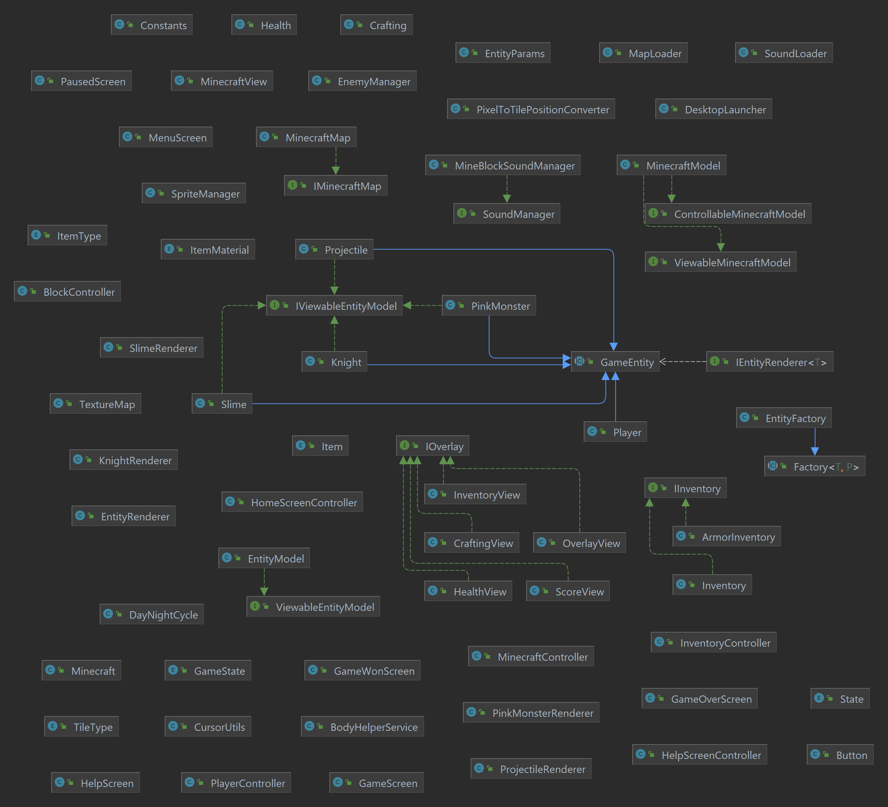

# Rapport – innlevering 4
**Team:** *Team 6* – *Magnus, Samuel, Nini, Martine*

#### Prosjektrapport

Følgende skal med i team/prosjekt-rapporten, enten ved at det går frem fra referatene, og/eller at dere skriver en oppsummering. Sjekk at dere har vært innom alle punktene, selv om det bare er for å si at det fungerer bra.

##### Roller

Rollene i teamet fungerer nå bra! vi føler ikke på noe behov for å gjøre endringer i rollefordelingen. 

##### Prosjektmetodikk & referat

Vi synes at prosjektmetodikken vår har fungert ganske bra. Vi har benyttet oss av et project board gjennom Asana - men vi har det nå på Issue Boards på Git pga. det ikke var mulig å gjøre Asana prosjektet vårt offentlig. Vi bruker issue boardet til å liste opp oppgaver, og det hjelper oss å ha kontroll. 

I tillegg har vi alltid en ukentlig gjennomgang under ukens gruppetime - da går vi gjennom hva som må prioriteres den neste uken.

Vi har også hatt en del møter utenom gruppetimer for å diskutere og planlegge videre arbeid - dette har vært veldig nyttig for oss.

Noen av gruppemedlemmene har også parprogrammert som har vært veldig nyttig for å løse vanskelige oppgaver.

Kanban tavlen vår består av 5 kolonner: "Gjøremål", "Pågående", "Gjennomgang", "Testes" og "Fullført".
I disse kolonnene legger teammedlemmer til oppgaver de ønsker skal gjøres, og etter hvert som oppgaver blir tildelt og gjennomført, flyttes oppgaven fra kolonne til kolonne. 
Det gjør det mulig for oss å få oversikt over hva som må gjøres, hva som er under arbeid, hva som er ferdig og hvem som har ansvar for hva.
Slik skal man kunne unngå at to eller flere medlemmer implementerer samme funksjonalitet. 

Bruk av KanBan har gjort at prosektet ikke har blitt for overveldende. 
Likevel har vi kanskje ikke tatt i bruk denne prosjektmetodikken på en helt optimal måte, ettersom vi har fokusert mer på kommunikasjon og fordeling av oppgaver under fysiske møter eller via Discord.
Dette har blant annet ført til at vi ikke har hatt like god oversikt som vi burde hatt, bl.a. fordi vi har glemt/vært treige på å skrive ned i "Gjøremål" kolonnen, og det har hendt at noen har implementert samme funksjonalitet. 

Referatene fra alle møtene våre er å finne i referat-mappen vår. [Klikk her for å på siste referat.](referat/Referat-03.05.2024.txt)

##### Gruppedynamikk

Gruppedynamikken er god, og vi har en god kommunikasjon på Discord. Vi har ikke hatt noen store uenigheter som har trengt å løses.

##### Retrospektiv 

- [ ] Gjør et kort retrospektiv hvor dere vurderer hva dere har klart til nå, og hva som kan forbedres. Dette skal handle om prosjektstruktur, ikke kode. Dere kan selvsagt diskutere kode, men dette handler ikke om feilretting, men om hvordan man jobber og kommuniserer.
- [ ] Bli enige om maks tre forbedringspunkter fra retrospektivet, som skal følges opp under neste sprint.
- [ ] For siste innlevering (Oblig 4): Gjør et retrospektiv hvor dere vurderer hvordan hele prosjektet har gått. Hva har dere gjort bra, hva hadde dere gjort annerledes hvis dere begynte på nytt?

==Skriv ferdig denne delen==

##### Fordeling av bidrag til kodebasen

Vi deler jevnt på arbeidsoppgavene og alle bidrar til kodebasen.

#### Krav og spesifikasjon

##### MVP-Krav

Vi nådde MVP-kravet i forrige innlevering. Vi har nå jobbet med å legge til flere funksjoner og forbedre brukeropplevelsen. Vi har også jobbet med å fikse bugs og forbedre koden vår. For oversikt over kravene vi har jobbet med se oblig 3 [her](oblig3.md). 

Vårt stretch goal er:
- [ ] Legge til flere ting man kan crafte
- [ ] Flere typer blokker og items
- [ ] Gjøre det lettere for spilleren å se hvilken blokk som er markert når man skal fjerne/plassere en blokk (f.eks. ha en tydelig rød boks rundt kantene på blokken)
- [ ] Lagre spillet og laste det inn igjen

###### Brukerhistorier, akseptansekriterier & prioritering av arbeidsoppgaver
Se mer i tidligere oblig for å få en oversikt over brukerhistorier, akseptansekriterier og arbeidsoppgaver, [her](oblig3.md). 

###### Bugs
- Spilleren blir "stuck" når den beveger seg langt til høyre på kartet, men når man "hopper" eller går en annen vei, beveger den seg igjen. 

#### Produkt og kode

##### Hvordan bygge, teste og kjøre prosjektet
- [x] I README.md: Dere må dokumentere hvordan prosjektet bygger, testes og kjøres, slik at det er lett for gruppelederne å bygge, teste og kjøre koden deres. Under vurdering kommer koden også til å brukertestes. [Klikk her for å se README.md](../README.md)
- [ ] Prosjektet skal kunne bygge, testes og kjøres på Linux, Windows og OS X – dere kan f.eks. spørre de andre teamene på gruppen om dere ikke har tilgang til alle platformene. OBS! Den vanligste grunnen til inkompatibilitet med Linux er at filnavn er case sensitive, mens store/små bokstaver ikke spiller noen rolle på Windows og OS X. Det er viktig å sjekke at stiene til grafikk og lyd og slikt matcher eksakt. Det samme vil antakelig også gjelde når man kjører fra JAR-fil.
- [ ] Utførte oppgaver skal være ferdige. Slett filer/kode som ikke virker eller ikke er relevant (ennå) for prosjektet. (Så lenge dere har en egen git branch for innlevering, så er det ikke noe stress å fjerne ting fra / rydde den, selv om dere fortsetter utviklingen på en annen gren.)

For instrukser ift. bygging, testing og kjøring av kode [se README.md.](../README.md)
Vi har testet at prosjektet fungerer på Windows og OS X og har sjekket Linux gjennom en VM. 

##### Dette har vi fikset siden sist:
- Vi har nå tatt i bruk flere interfaces.
- Vi har kommentert koden der nødvendig og har nå javadocs på alle public-metoder.
- Vi har nå laget en abstrakt objektfabrikk som vi benytter for å opprette enemies.
- Vi har også gjort det tydligere i Readme.md hvordan man kan nå hjelpesiden. 
- Vi har fikset build.gradle slik at det nå er mulig å kjøre prosjektet fra en jar-fil. Og oppdatert README.md med instrukser for hvordan man kjører prosjektet fra en jar-fil.

##### Utbedring av feil & testing

Vi har nå ca. 86% testdekning - noe vi er fornøyde med! Vi har funnet ut gjennom testing at det har vært en del feil i koden vår - som vi nå har rettet opp i underveis.

##### Manuelle tester:

1. **Spillerbevegelse og interaksjon**:
   - Test at spilleren kan bevege seg (venstre, høyre). Gå til venstre med 'A' og høyre med 'D'.
   - Test at spilleren kan hoppe og angripe fiender. Hopp med 'SPACE' og angrip med 'TAB'.

2. **Fiender**:
   - Sjekk at fiender beveger seg på en forutsigbar måte og angriper spilleren når de er i nærheten.
   - Sjekk at fiender kan bli drept eller skadet av spilleren ved bruk av våpen eller andre midler.

3. **Inventar**:
   - Test at spilleren kan legge til, fjerne og bruke gjenstander fra inventaret.
   - Test at spilleren kan samhandle med miljøet (ved å hakke inn blokker eller plassere blokker). Bruk venstreklikk for å fjerne en blokk når musen er over blokken, og høyreklikk for å plassere en blokk når musen er over en tom rute.

4. **Crafting**:
   - Test at spilleren kan åpne crafting-vinduet ved å trykke 'E' og 'E' for å lukke det.
   - Test at crafting-oppskrifter vises riktig.
   - Test at spilleren kan bruke crafting til å lage nye gjenstander ved å trykke 'ENTER'.

Disse manuelle testene vil bidra til å sikre at spillet fungerer som forventet.

##### Klassediagram

Se nedenfor for klassediagram av koden vår:

